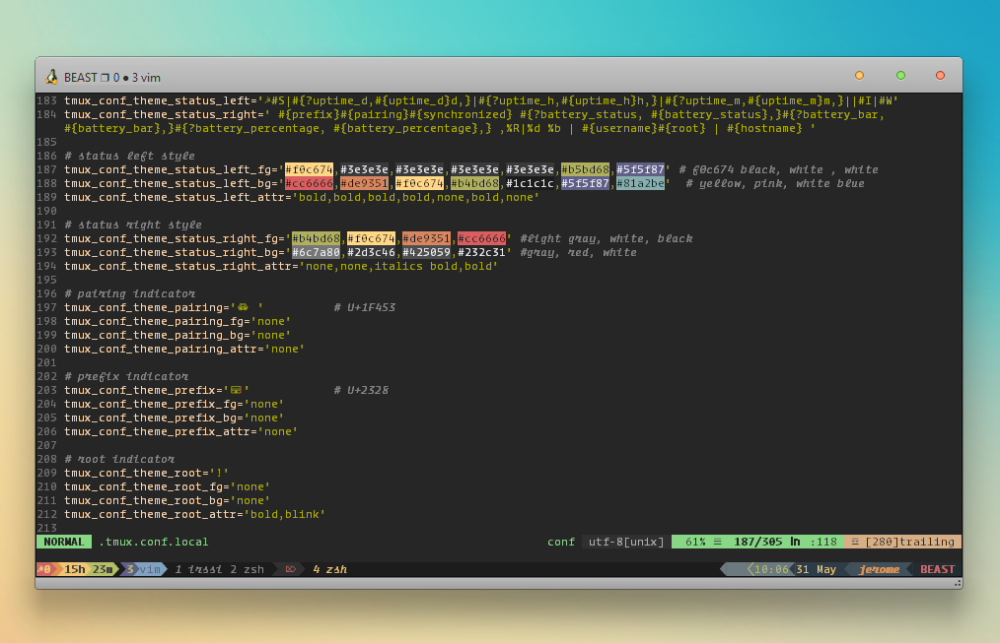

jrmux II: multiplexer boogaloo
==============================

A contemporary refresh of [gpakosz]'s most excellent [tmux configuration] files, tweaked to make the most of modern terminals.




Installation
------------

For an automated install, simply clone this folder into your home directory, navigate to it, and run `install.sh`:

```
cd
git clone https://github.com/jeromescuggs/.tmux
cd .tmux && ./install.sh
```

**NOTE**: during the installation, the install script will look for `.tmux.conf` and `.tmux.conf.local` files in the `$HOME` directory, make copies, and store the copies in this git folder as backups.

@[gpakosz] maintains a very thorough `README.md` file which covers a bunch of answers and troubleshooting tips. Initially this repo contained a copy of his readme with slight edits at the top, which can still be seen by viewing the `README-original.md` file. 

Playing nice with vim
---------------------

Vim configs which make use of `set termguicolors` will break inside tmux, and fail to render accurate colors. 

the solution is two-fold. the included `.tmux.conf.local` config includes the first part by default, which is including this line: 

~~~ vim
set -ga terminal-overrides ",*256color*:Tc"
~~~

this is fairly robust and will work nicely with `$TERM` variables such as `xterm-256color`, `screen-256color`, and `tmux-256color`. 

your vimrc needs to be configured as well. in the interest of flexibility, adding this line to your vimrc will allow you to 'set-and-forget-it' - coupled with the above you will have zero issues regardless of whether or not you are using vim inside or outside of tmux, with `set termguicolors` enabled or not: 

~~~ vim
" workaround to let termguicolors play nice with tmux
if exists('+termguicolors')
  let &t_8f = "\<Esc>[38;2;%lu;%lu;%lum"
  let &t_8b = "\<Esc>[48;2;%lu;%lu;%lum"
  set termguicolors
endif
~~~

Alternate version
-----------------

I have included an alternate config file, `.tmux.conf.alt.local`. It makes some changes to the way the statusbar information is laid out, in an effort to slim down the statusbar, by reducing unused spaces while also preserving the aesthetic styling. 

A major change with this version is the 'active window' title has been permanently moved to the left statusbar display. The active window's tab itself is labelled with a '⌦' symbol. 

[gpakosz]: https://github.com/gpakosz
[tmux configuration]: https://github.com/gpakosz/.tmux
